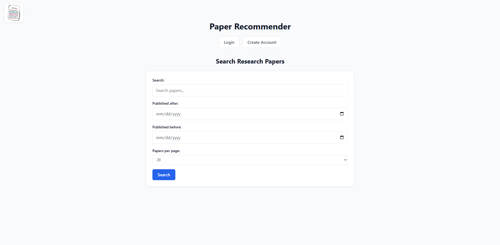
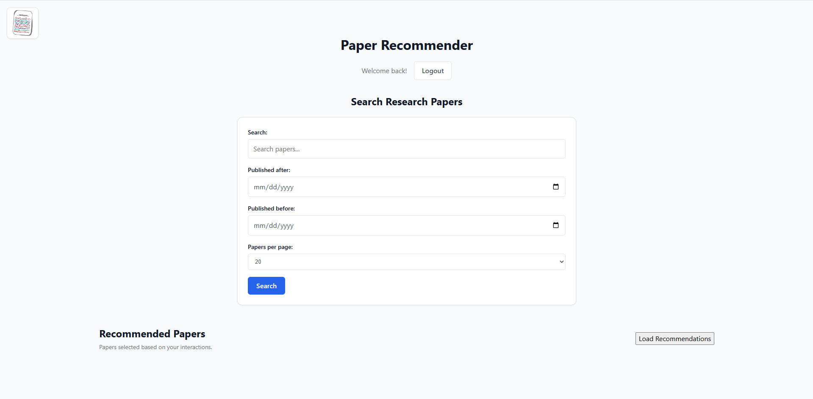
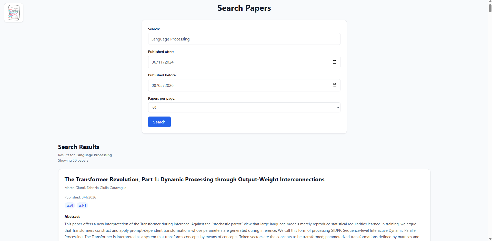
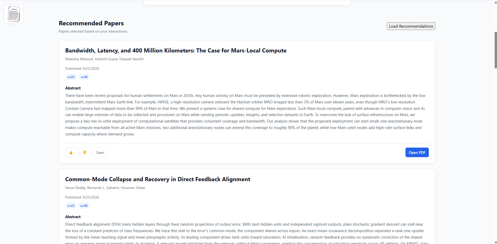
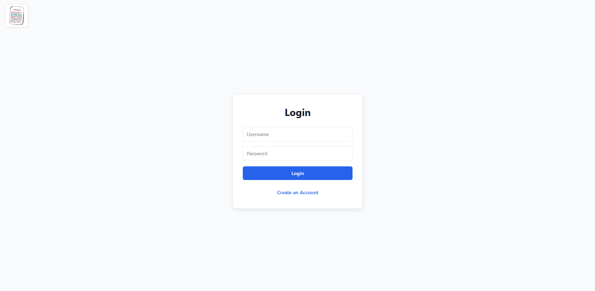
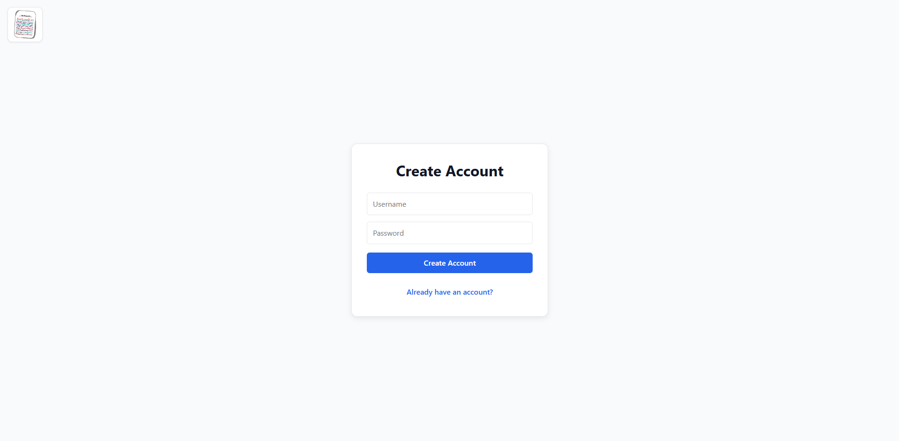

# Research Paper Recommendation Platform

A full-stack research paper discovery and recommendation application built with Python, FastAPI, PostgreSQL, React, and scikit-learn.

## Overview
The application ingests paper metadata from arXiv, stores normalized data in PostgreSQL, supports search and authentication, tracks user interactions, and generates personalized paper recommendations.

## Features
- arXiv paper ingestion pipeline
- PostgreSQL relational database
- Full-text paper search
- JWT authentication
- Personalized recommendations
- Likes, dislikes, saves, views, and PDF-open tracking
- React frontend
- FastAPI REST backend

## Recommendation Approach
The ranking system combines:
- Category affinity
- TF-IDF cosine similarity
- Explicit user feedback
- Implicit behavioral signals

## Architecture
Frontend → FastAPI API → PostgreSQL
                     ↓
              Recommendation Engine

## Tech Stack
- Python
- FastAPI
- PostgreSQL
- React
- scikit-learn
- JWT

## Screenshots

### Home Page
The main landing page allows users to search for research papers, filter by publication date, and control the number of results returned.

### Logged-In Home Page
Authenticated users can access personalized recommendations in addition to the standard search functionality.

### Search Results
Users can search for papers by topic and filter results by publication date. Search results display paper metadata, categories, abstracts, and available actions.

### Personalized Recommendations
The recommendation system ranks papers based on user interests and interaction history. Users can like, dislike, save, view, or open papers to provide additional feedback to the recommendation engine.

### Authentication

#### Login
Users can securely log in to access personalized features including recommendations.

#### Create Account
New users can create an account to begin tracking interactions and receiving personalized recommendations.

